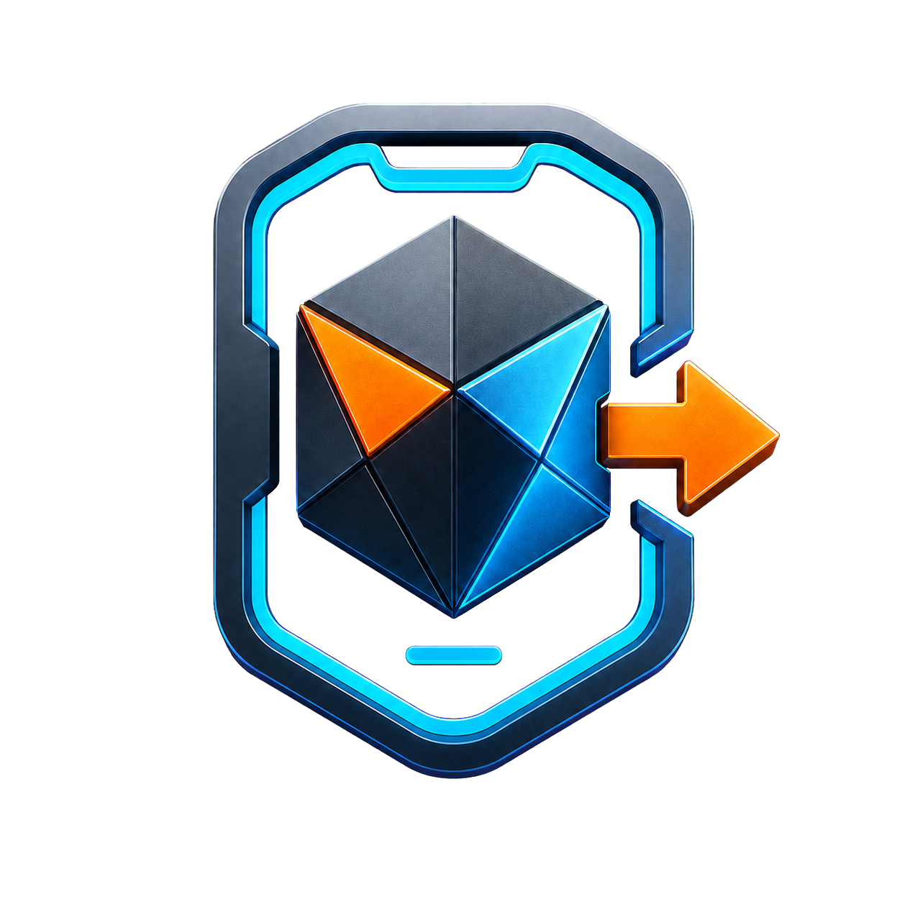

  

<h1 align="center">Blender Mobile 3D Plugin</h1>

  Готовое к промышленному использованию дополнение Blender для подготовки и экспорта оптимизированных 3D-ресурсов для мобильных игр.

  <!--
  --><!--
  --><!--
  --><!--
  -->

[Русский] Плагин для подготовки 3D-ассетов для мобильных игр в Blender.

Полная документация на русском: [docs/ru/full-docs.md](docs/ru/full-docs.md)

→ [English](README.en.md) | [Polski](README.pl.md) | [正體中文](README.zh-Hant.md)
